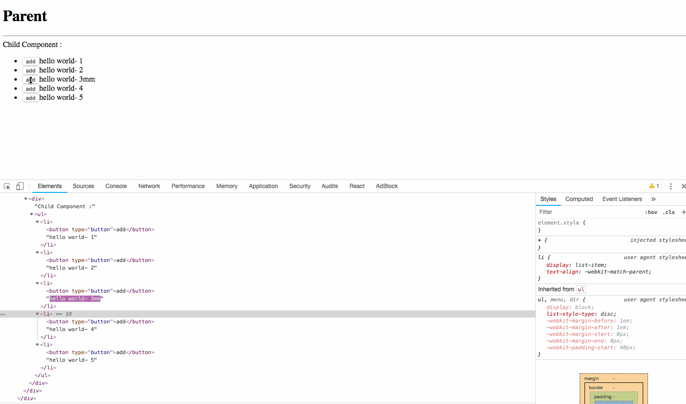

# Lab 4 - Component Lifecycle - avoid render() called each time. find how react rendor dom tree

## Lab 4.1 Component's render() was invoked when state change or props change

### Step 1. Install package

```bash
cd react-demo
npm install
```

### Step 2. Run the project

```bash
npm start
```

becuase create-react-app auto config webpack and webpack dev server hot reload,
you will find browser open http://localhost:3000 when start server.

### Step 3. Check lifecycle when click button to update parent component(App.js) state

1. Open F12 or command+option+i to see the console.
2. See timer change, console will print message from lifecycle hook method.

You can find out child 1 call render every second, even if there's props are unchange.

But even if Children componet's render() are called, Browser's DOM tree doesn't change.

Becaue React still diff the Virtual DOM change to apply into the real DOM

### Step 4. Edit react-demo/src/App.js

change code below

```js
import React, { Component } from 'react'
- import Children from './Children';
+ import Children from './ChildrenPure';
```

webpack-dev-server will auto compiling and hot reload browser

please find messages at developer console.

child 1 invoke componentWillReceiveProps(), but no render() method are invoked,

This is because ChildrenPure extend use the bulltin "PureComponent" component.

This can help you to avoid extra render() being invoked.

## Lab 4.2 re-render dom when random assign key of list

### Step 1. Install react-demo2 package

```bash
cd react-demo2
npm install
```

### Step 2. Run the project react-demo2

```bash
npm start
```

### Step 3. Open borwser to see developer console

Find Children Component, and Click add button to see DOM Element change on Developer Tools

Because use random changed key, all li are re-render


### Step 4. Edit Chiddren.jsx

```js
- return <li key={randomId + index}>
+ return <li key={index}>

```

And check again.



Only change modified li, because we use the same unqie key